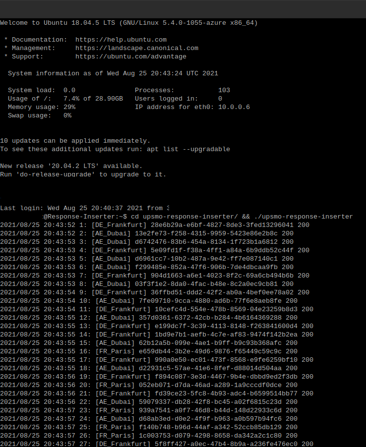

# upsmo-checker

It runs in a VM where it can easily reach the database server and listens to service bus messages which are sent to insert into the database by the upsmo-checker. It inserts messages into the database when the collected messages reach enough count.

## Prerequisites to run

* [Golang](https://golang.org/dl/)

## Installation & Run

* `git clone https://github.com/halilkocaoz/upsmo-response-inserter.git`
* `export AZURE_POSTGRES_CONNSTR="host=name.postgres.database.azure.com port=5432 dbname=- user=- password=-"`
* `export SERVICE_BUS_NAMESPACE="namespace"`
* `export SERVICE_BUS_SHARED_ACCESS_KEY_VALUE="key"`
* `cd upsmo-checker && go mod download && go run .`

## Related repositories

* [upsmo-checker](https://github.com/halilkocaoz/upsmo-checker)
* [upsmo-notifier](https://github.com/halilkocaoz/upsmo-notifier)
* [upsmo-server](https://github.com/halilkocaoz/upsmo-server)

## Screenshot

